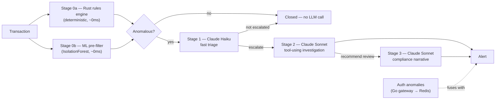

# VaultWatch

**A tiered, cost-aware multi-agent Claude pipeline that fuses financial-fraud detection with account-security signals into one operations view.**

**Live showcase: https://dashboard-web-three-sable.vercel.app**

VaultWatch answers a question a fraud team and a security team usually can't answer together: *is this high-value transfer suspicious because the account looks compromised, not just because the amount is unusual?* A rules engine and a fraud model looking at transactions alone will miss that. A SIEM looking at logins alone will miss it too. VaultWatch correlates both streams and only escalates the cases where it actually matters.

Everything in this repository — every account, transaction, name and entity graph — is **synthetic**, generated by seeded RNGs. Nothing here is real financial or personal data.

---

## Why it's built this way

Calling an LLM on every transaction is slow and expensive. VaultWatch routes each transaction through cheap, deterministic tiers first, and only escalates to a model when the evidence actually warrants it:



Stage 0 filters out the overwhelming majority of traffic for free. Only genuine anomalies reach Haiku. Only Haiku-escalated cases reach Sonnet, which does real agentic work — it decides what evidence it needs (transaction history, entity graph, sanctions screen) and calls tools to get it, rather than guessing from the prompt alone. Compliance drafting is the most expensive tier and only runs when the investigator recommends it.

Independently, VaultWatch's Go auth gateway watches logins for impossible-travel and credential-stuffing patterns and publishes those as security events. The orchestrator fuses a recent security event with a financial alert on the same account into a single **critical** alert — the actual point of the system.

---

## Architecture

| Service | Stack | Responsibility |
|---|---|---|
| [`engine-rust/`](engine-rust) | Rust, Axum | Deterministic risk-rules scoring; a SHA-256 hash-chained, tamper-evident audit log |
| [`gateway-go/`](gateway-go) | Go | Auth (Argon2id, rotating JWT refresh with reuse detection), rate limiting, login-anomaly detection (impossible travel, brute force) |
| [`agents-python/`](agents-python) | Python, FastAPI, scikit-learn, Anthropic SDK | The agentic core: ML pre-filter, and the Haiku/Sonnet tiered agent pipeline with tool use, security-event fusion, WebSocket streaming |
| [`dashboard-web/`](dashboard-web) | Next.js, TypeScript | The live ops dashboard. Ships in two modes (see below) |

Postgres backs user accounts, refresh tokens, and case history. Redis carries security events from the Go gateway to the Python orchestrator via pub/sub.

### Dashboard modes

`dashboard-web` runs in one of two modes, selected by `NEXT_PUBLIC_MODE`:

- **`showcase`** (default, what's deployed to Vercel): a self-contained TypeScript port of the entire pipeline runs as Next.js Route Handlers — its own rules engine, heuristic pre-filter, and Haiku/Sonnet agents, with a deterministic zero-cost **replay mode** that activates automatically when no `ANTHROPIC_API_KEY` is configured. This is what lets the public demo run for free; add a key to the Vercel project to switch it to live Claude calls with no code change.
- **`full`**: the dashboard connects to the real Rust/Go/Python services over WebSocket and REST, for reviewing the complete polyglot system via `docker compose up`.

Both modes render the same UI from the same event shapes — the dashboard components don't know which mode they're in.

---

## Running it

### Full stack (recommended for review)

```bash
cp .env.example .env   # add ANTHROPIC_API_KEY to see live Claude reasoning; leave blank for replay mode
docker compose up --build
```

- Dashboard: http://localhost:3000
- Gateway (auth + proxied scoring): http://localhost:8080
- Risk engine (direct): http://localhost:8081
- Agent orchestrator (direct): http://localhost:8000

The dashboard auto-generates a synthetic transaction every few seconds and occasionally mints a deliberately risky one, so the full escalation chain is visible without doing anything. There's also a "Send risky transaction" button.

### Individual services

Each service is independently runnable and tested:

```bash
# Rust
cd engine-rust && cargo test && cargo run

# Go
cd gateway-go && go test ./... && go run ./cmd/gateway

# Python
cd agents-python && pip install -r requirements-dev.txt && pytest && uvicorn app.main:app --reload

# TypeScript
cd dashboard-web && npm install && npm run dev
```

---

## Threat model / what's real vs. synthetic

- **Real**: the rules logic, the hash-chained audit log and its tamper detection, the JWT rotation and refresh-token-reuse detection, the brute-force/impossible-travel detectors, the ML pre-filter, and the full multi-agent tool-use loop (in live mode, these are genuine Claude API calls with genuine tool execution).
- **Synthetic**: every account, transaction, login, entity graph and sanctions-list entry. The compliance narratives are explicitly labeled as synthetic demonstrations, not real filings or legal advice.
- **Known limitation**: showcase mode's audit log and case history live in serverless-instance memory, not a database — they demonstrate the mechanism, not durable storage. `docker compose` mode uses the real file-backed Rust audit log and Postgres.

## CI

Every push runs `cargo test`/`clippy`/`fmt`, `go test`/`vet`, `pytest`/`ruff`, and `next build`/`eslint` across the four services — see [`.github/workflows/ci.yml`](.github/workflows/ci.yml).

## License

[MIT](LICENSE)
