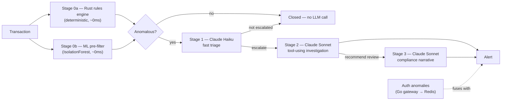

# VaultWatch

[](https://github.com/Assembler-Fourier/vaultwatch/actions/workflows/ci.yml)

**A tiered, cost-aware multi-agent Claude pipeline that fuses financial-fraud detection with account-security signals into one operations view.**

**Live showcase (click it, it's real and running): https://dashboard-web-three-sable.vercel.app**

VaultWatch answers a question a fraud team and a security team usually can't answer together: *is this high-value transfer suspicious because the account looks compromised, not just because the amount is unusual?* A rules engine and a fraud model looking at transactions alone will miss that. A SIEM looking at logins alone will miss it too. VaultWatch correlates both streams and only escalates the cases where it actually matters.

Everything in this repository — every account, transaction, name and entity graph — is **synthetic**, generated by seeded RNGs. Nothing here is real financial or personal data.

---

## Why it's built this way

Calling an LLM on every transaction is slow and expensive. VaultWatch routes each transaction through cheap, deterministic tiers first, and only escalates to a model when the evidence actually warrants it:



Stage 0 filters out the overwhelming majority of traffic for free. Only genuine anomalies reach Haiku. Only Haiku-escalated cases reach Sonnet, which does real agentic work — it decides what evidence it needs (transaction history, entity graph, sanctions screen) and calls tools to get it, rather than guessing from the prompt alone. Compliance drafting is the most expensive tier and only runs when the investigator recommends it.

Independently, VaultWatch's Go auth gateway watches logins for impossible-travel and credential-stuffing patterns and publishes those as security events. The orchestrator fuses a recent security event with a financial alert on the same account into a single **critical** alert — the actual point of the system.

---

## Architecture

| Service | Stack | Responsibility |
|---|---|---|
| [`engine-rust/`](engine-rust) | Rust, Axum | Deterministic risk-rules scoring; a SHA-256 hash-chained, tamper-evident audit log |
| [`gateway-go/`](gateway-go) | Go | Auth (Argon2id, rotating JWT refresh with reuse detection), rate limiting, login-anomaly detection (impossible travel, brute force) |
| [`agents-python/`](agents-python) | Python, FastAPI, scikit-learn, Anthropic SDK | The agentic core: ML pre-filter, and the Haiku/Sonnet tiered agent pipeline with tool use, security-event fusion, WebSocket streaming |
| [`dashboard-web/`](dashboard-web) | Next.js, TypeScript | The live ops dashboard. Ships in two modes (see below) |

Postgres backs user accounts, refresh tokens, and case history. Redis carries security events from the Go gateway to the Python orchestrator via pub/sub.

### Dashboard modes

`dashboard-web` runs in one of two modes, selected by `NEXT_PUBLIC_MODE`:

- **`showcase`** (default, what's deployed to Vercel): a self-contained TypeScript port of the entire pipeline runs as Next.js Route Handlers — its own rules engine, heuristic pre-filter, and Haiku/Sonnet agents, with a deterministic zero-cost **replay mode** that activates automatically when no `ANTHROPIC_API_KEY` is configured. This is what lets the public demo run for free; add a key to the Vercel project to switch it to live Claude calls with no code change.
- **`full`**: the dashboard connects to the real Rust/Go/Python services over WebSocket and REST, for reviewing the complete polyglot system via `docker compose up`.

Both modes render the same UI from the same event shapes — the dashboard components don't know which mode they're in.

---

## Running it

### Full stack (recommended for review)

```bash
cp .env.example .env   # add ANTHROPIC_API_KEY to see live Claude reasoning; leave blank for replay mode
docker compose up --build
```

- Dashboard: http://localhost:3000
- Gateway (auth + proxied scoring): http://localhost:8090
- Risk engine (direct): http://localhost:8081
- Agent orchestrator (direct): http://localhost:8000

The dashboard auto-generates a synthetic transaction every few seconds and occasionally mints a deliberately risky one, so the full escalation chain is visible without doing anything. There's also a "Send risky transaction" button.

### Individual services

Each service is independently runnable and tested:

```bash
# Rust
cd engine-rust && cargo test && cargo run

# Go
cd gateway-go && go test ./... && go run ./cmd/gateway

# Python
cd agents-python && pip install -r requirements-dev.txt && pytest && uvicorn app.main:app --reload

# TypeScript
cd dashboard-web && npm install && npm run dev
```

---

## Proof this actually runs

Beyond the [live showcase](https://dashboard-web-three-sable.vercel.app) and the [CI badge](https://github.com/Assembler-Fourier/vaultwatch/actions/workflows/ci.yml) at the top of this file, here's an actual response captured straight from `docker compose up` — all four containers, real inter-service HTTP calls (`dashboard-web` → `agents-python` → `engine-rust`), no mocking. `MODE=auto` and no `ANTHROPIC_API_KEY` were set for this specific capture, so the Haiku/Sonnet stages ran through the deterministic `ReplayProvider` rather than spending on a live call — same orchestrator, same tool-execution loop, same JSON contracts as live mode, just swapping what answers the model calls (see `agents-python/app/llm/provider.py`):

```bash
$ curl -s -X POST "http://localhost:8000/v1/pipeline/run?force_risky=true" | python -m json.tool
```

<details>
<summary>Full response (rules → pre-filter → triage → investigation → compliance → alert, one real transaction, one real HTTP round trip)</summary>

```json
{
    "transaction": {
        "id": "tx_386cdb4ea205",
        "account_id": "acct_90851",
        "amount": 4510.43,
        "currency": "EUR",
        "timestamp": "2026-07-17T17:20:06.462270Z",
        "lat": 51.5072,
        "lon": -0.1276,
        "beneficiary_id": "ben_441582",
        "device_id": "dev_984067"
    },
    "stage_reached": "compliance",
    "rules": {
        "risk_score": 100,
        "risk_band": "critical",
        "triggered_rules": [
            { "rule": "velocity_amount", "weight": 20, "detail": "cumulative amount in the last hour is 9020.86 (threshold 5000.00)" },
            { "rule": "amount_outlier", "weight": 30, "detail": "amount 4510.43 is 147.6 standard deviations above the account mean (121.28)" },
            { "rule": "impossible_travel", "weight": 40, "detail": "16994km in 1.00h implies 16999km/h (threshold 900km/h)" },
            { "rule": "new_beneficiary_high_value", "weight": 25, "detail": "first payment to beneficiary ben_441582 for 4510.43 (threshold 1000.00)" },
            { "rule": "new_device", "weight": 10, "detail": "device dev_984067 has not been seen on this account before" }
        ]
    },
    "prefilter": { "anomaly_score": 0.7137592948482069, "is_anomaly": true },
    "triage": {
        "fraud_likelihood": 0.82,
        "category": "potential_account_takeover",
        "escalate": true,
        "reasoning": "The transaction stacks a statistical amount outlier with a first-time beneficiary, and the pre-filter and rules engine both flagged it independently. That combination is consistent with a compromised account being drained rather than normal spending drift."
    },
    "case": {
        "summary": "Account acct_90851 sent an out-of-pattern high-value payment to a beneficiary never seen before on this account. Transaction history shows a stable spending baseline that this payment breaks sharply. The entity graph shows shared-device links to other accounts opened in a short window, a pattern consistent with a fraud ring rather than an isolated compromised account.",
        "risk_score": 87,
        "evidence": [
            "Transaction amount is a statistical outlier vs. 12 recent transactions",
            "Beneficiary has no prior payment history on this account",
            "Entity graph shows shared-device links to other recently opened accounts",
            "Sanctions screen against synthetic watchlist returned no direct hit"
        ],
        "linked_accounts": ["acct_08511", "acct_08512"],
        "sanctions_hit": false,
        "recommend_compliance_review": true
    },
    "compliance": {
        "narrative": "SYNTHETIC DRAFT - account acct_90851 exhibited a sharp deviation from its established transaction pattern, sending a high-value payment to a previously unseen beneficiary. The receiving account shares device fingerprints with multiple other recently opened accounts, a pattern consistent with mule-account activity. Recommend manual review and, if confirmed, filing consistent with the institution's AML program before further funds movement.",
        "obligations_referenced": [
            "EU AMLD5/6 - suspicious transaction reporting obligation",
            "Central Bank of Ireland - Criminal Justice (Money Laundering and Terrorist Financing) Act 2010 (as amended) reporting expectations"
        ],
        "disclaimer": "Synthetic demonstration output only. Not legal or regulatory advice, and not a real Suspicious Activity Report."
    },
    "alert": {
        "severity": "high",
        "title": "Financial risk alert",
        "fused_with_security_event": false
    }
}
```

</details>

**This capture is also how a real bug got found and fixed**, not hypothetically: the first time this ran against the real Postgres-backed case store (as opposed to the unit tests' mocked store), every escalated transaction failed to persist with `TypeError: Object of type datetime is not JSON serializable` — `PipelineResult.as_dict()` was using Pydantic's `model_dump()` instead of `model_dump(mode="json")`, so `Alert.timestamp` reached `json.dumps()` as a raw Python object. The WebSocket broadcasts (which fire before the failed save) still worked, so the dashboard looked fine while the persistence layer was silently broken underneath it - exactly the kind of bug that only shows up when you run the whole stack, not just the unit tests. Fixed in [`agents-python/app/orchestrator.py`](agents-python/app/orchestrator.py) - see the commit history for this and a second real bug (a WebSocket connection cleanup issue that could cause the live feed to receive duplicate events) found and fixed the same way.

---

## Threat model / what's real vs. synthetic

- **Real**: the rules logic, the hash-chained audit log and its tamper detection, the JWT rotation and refresh-token-reuse detection, the brute-force/impossible-travel detectors, the ML pre-filter, and the full multi-agent tool-use loop (in live mode, these are genuine Claude API calls with genuine tool execution).
- **Synthetic**: every account, transaction, login, entity graph and sanctions-list entry. The compliance narratives are explicitly labeled as synthetic demonstrations, not real filings or legal advice.
- **Known limitation**: showcase mode's audit log and case history live in serverless-instance memory, not a database — they demonstrate the mechanism, not durable storage. `docker compose` mode uses the real file-backed Rust audit log and Postgres.

## CI

Every push runs `cargo test`/`clippy`/`fmt`, `go test`/`vet`, `pytest`/`ruff`, and `next build`/`eslint` across the four services — see [`.github/workflows/ci.yml`](.github/workflows/ci.yml).

## License

[MIT](LICENSE)
